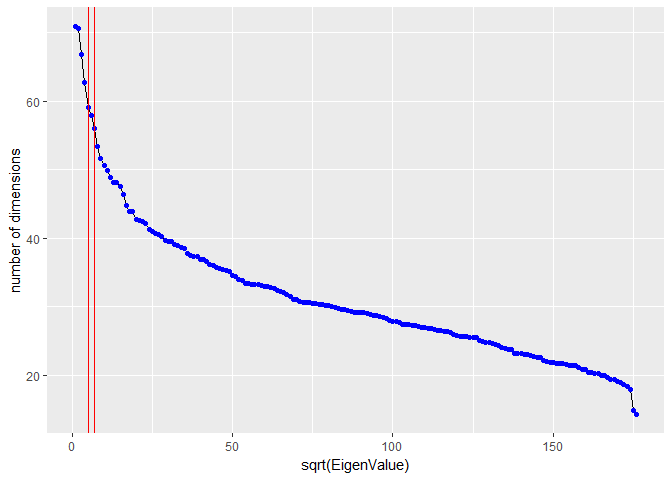
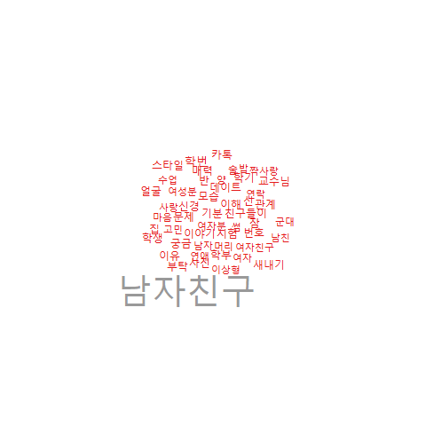
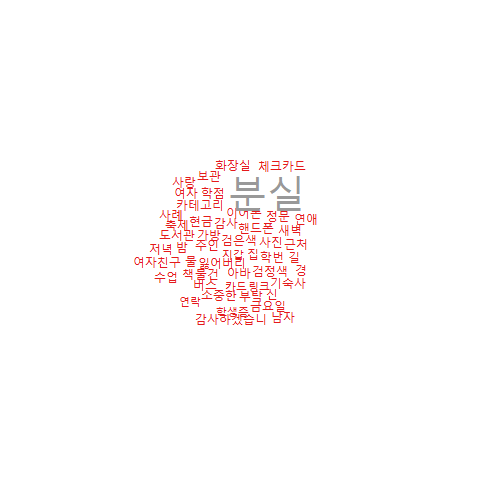
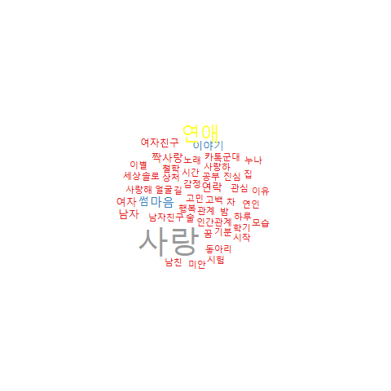
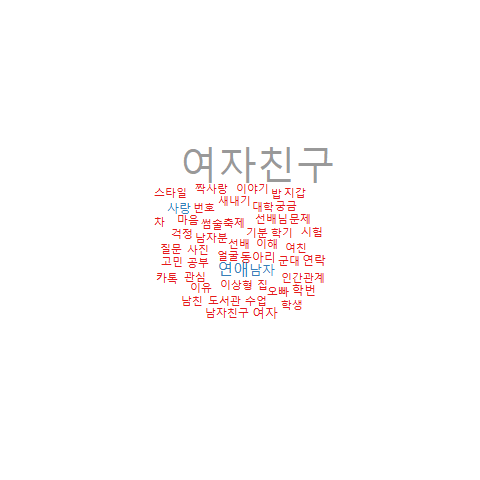

## LSA

In this document, we will skip actuall running of the codes, 
1) it takes more than an hour for running
2) Knitting the rmd has encoding problems unresolved.
if you want to run the code, remove eval=FALSE.

1. Load Prepared Data

```{r eval=FALSE}
load("FinalFBdata.RData")
```

2. Settings
```{r eval=FALSE} 
#Packages to use
packages = c("Rfacebook", "tm", "lsa", "wordcloud","ggplot2","KoNLP",
             "GPArotation","cluster","RWeka","ROAuth","fpc","stringr","ape","devtools")

for (i in packages){
  if(!require( i , character.only = TRUE))
  {install.packages(i, dependencies = TRUE)}
}


#Settings for NLP

pdf.options(family="Korea1deb") #not to tear down the letters
options(java.parameters=c("-Xmx4g","-Dfile.encoding=UTF-8")) #to increse heap size of rjava
options(mc.cores=1)
useNIADic()

#Wordcloud Color settting
pal <- brewer.pal(9,"Set1")

```

3. Extract Nouns
```{r eval=FALSE, results='hide'}

# remove pucntuation: punctuation raise error
file1 <- unlist(file1)
file1 <- gsub("[[:punct:]]"," ",file1)

# remove redundant whitespace
file1 <- gsub("\\s+"," ", file1)


getNouns <- function(doc){
  doc <- as.character(doc)
  doc2 <- paste(SimplePos22(doc))
  doc3 <- str_match(doc2, "([가-??+)/NC")

  if( dim(doc3)[2] == 2){
    doc4 <- doc3[,2]
    doc4 <- doc4[!is.na(doc4)]
    return(doc4)
    }

}

nouns = sapply(file1,getNouns, USE.NAMES = F)

txt_noun1 <- nouns
```

4. Set the stop words
    * stop words are updated after several analyses
```{r eval=FALSE}
words <- read.csv("2nd_stopwords.txt",header=FALSE)
words <- as.character(words$V1)
words <- c(words,c("싶","익명","갯짓","학과"))
words <- c(words, c("아대","있"))
```
    
5. Make a corpus
```{r eval=FALSE}
# Vectorize the nouns 
corpus <- Corpus(VectorSource(txt_noun1))

# Removing numbers 
corpus <- tm_map(corpus, removeNumbers)

# Remove stopwords
corpus <- tm_map(corpus, removeWords, words)
```

6. Make a documentTermMatrix
```{r eval=FALSE}
control = list(tokenize = uniTokenizer,
               removeNumbers = TRUE,
               wordLengths=c(2,20),
               removePunctuation = TRUE,
               stopwords = c("\\n","\n","것","c"),
               weighting = function (x) {weightTfIdf(x, TRUE)})

dtm <- DocumentTermMatrix(corpus, control=control)

# Encoding correction
Encoding(dtm$dimnames$Terms) ='UTF-8'
```

7. Remove Sparse Terms
```{r eval=FALSE}
dt <- removeSparseTerms(dtm,0.994)
as.numeric(object.size(dt)/object.size(dtm)) * 100 # ratio of reduced/ original

# if dtm$i does not contain a particular row index p, then row p is empty.
check <- unique(dt$i)
dt <- dt[check,]
```

8. Make a LSA model
```{r eval=FALSE}
LSA <-lsa(dt,dim=5)
st <-LSA$tk
wd <- LSA$dk
strength <- LSA$sk

# Varimax Rotation for better explaination
rot <- GPForth(wd, Tmat=diag(ncol(wd)), normalize=FALSE, eps=1e-5,
               maxit=10000, method="varimax",methodArgs=NULL)


cord <- st %*% diag(strength) %*% rot$Th
signs <- sign(colSums(rot$loadings))
cord <- cord %*% diag(signs)
text_lsa <- data.frame(cord=cord,file=file1[check])
```

9. Find an Elbow (Scree Plot)
```{r eval=FALSE}
mysvd <- svd(dt)
ggplot(data = NULL, aes(x=seq_along(mysvd[["d"]]), y=mysvd[["d"]])) + 
  geom_line() + geom_point(colour="blue") + 
  xlab(label = "sqrt(EigenValue)")+ ylab("number of dimensions")+
  geom_vline(xintercept = 5, colour="red")+
  geom_vline(xintercept = 7, colour="red")
```



Appopriate dimension is around 5 ~ 7, through several analysis, we found that the fittest number of dimension was 5 in the point of plausable interpretation. 

9. Draw Word Clouds for each Dimension and Interpret!
```{r eval=FALSE}

showmedim <- function(dimen){
  t<-rot$loadings[,dimen]
  tt<-abs(t)
  terms<-names(tt)
  wordcloud(terms,tt,scale=c(4,1),rot.per=0,max.words=50, colors = pal)
}

showmedim(1)
showmedim(2)
showmedim(3)
showmedim(4)
showmedim(5)
```








## LDA
now with the fact that we have 5 main topics on this corpus, we can apply LDA on this.

```{r eval=FALSE}
#install.packages("lda")
#install.packages("LDAvis")
library(lda)
library(LDAvis)

doc.list <- txt_noun1[1:1000]

term.table <- table(unlist(doc.list))
term.table <- sort(term.table, decreasing = TRUE)

del <- names(term.table) %in% words | term.table < 5
term.table <- term.table[!del]
vocab <- names(term.table)

get.terms <- function(x) {
  index <- match(x, vocab)
  index <- index[!is.na(index)]
  rbind(as.integer(index - 1), as.integer(rep(1, length(index))))
}
documents <- lapply(doc.list, get.terms)

D <- length(documents)  # number of documents (2,000)
W <- length(vocab)  # number of terms in the vocab (14,568)
doc.length <- sapply(documents, function(x) sum(x[2, ]))  # number of tokens per document [312, 288, 170, 436, 291, ...]
N <- sum(doc.length)  # total number of tokens in the data (546,827)
term.frequency <- as.integer(term.table)  # frequencies of terms in the corpus [8939, 5544, 2411, 2410, 2143, ...]

K <- 5 # number of topics

G <- 5000
alpha <- 0.02
eta <- 0.02

library(lda)
set.seed(357)
t1<-Sys.time()
fit <- lda.collapsed.gibbs.sampler(documents = documents, K = K, vocab=vocab,
                                   num.iterations = G, alpha = alpha, 
                                   eta = eta, initial = NULL, burnin = 0,
                                   compute.log.likelihood = TRUE)
t2 <- Sys.time()
t2-t1

theta <- t(apply(fit$document_sums + alpha, 2, function(x) x/sum(x)))
phi <- t(apply(t(fit$topics) + eta, 2, function(x) x/sum(x)))

dat <- list(phi = phi,
                     theta = theta,
                     doc.length = doc.length,
                     vocab = vocab,
                     term.frequency = term.frequency)

options(encoding = 'UTF-8')

library(LDAvis)

# create the JSON object to feed the visualization:
json <- createJSON(phi = dat$phi, 
                   theta = dat$theta, 
                   doc.length = dat$doc.length, 
                   vocab = dat$vocab, 
                   term.frequency = dat$term.frequency, encoding='UTF-8')

#install.packages("servr")
library(servr)
serVis(json, out.dir = 'visualized', open.browser = FALSE)

```

[LDA Visaulized](visual/index.html)
